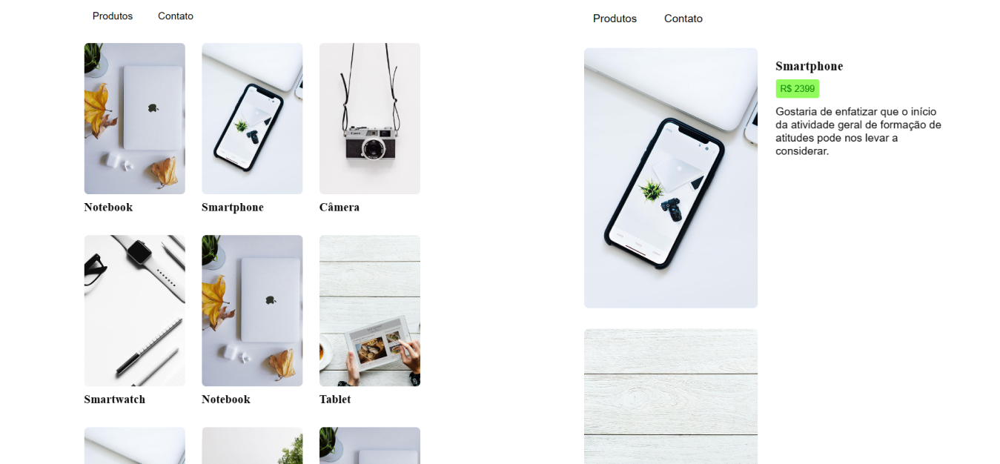

# Sobre o projeto

Raneki é uma aplicação Front-End web construída por min com conhecimentos adiquiridos ao longo desses últimos meses estudando programação.

A aplicação consiste em um site básico para conhecer seus produtos, onde as pessoas possam navegar o site de forma simples e prática.

  

# Tecnologias utilizadas

# Autor

João Félix Santana de Sousa

https://www.linkedin.com/in/joaofelixss
